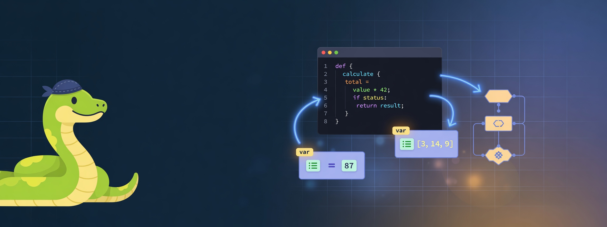

<div align="center">



# 🐍 مُفسّر بايثون المرئي

### Python Visual Explainer — افهم الكود قبل أن تحفظه

**أداة تعليمية مجانية ومفتوحة المصدر تشرح كود بايثون خطوة بخطوة بشكل بصري وباللغة العربية 🇸🇦**

[](LICENSE)
[](https://react.dev)
[](https://vitejs.dev)
[](https://www.typescriptlang.org)
[](https://tailwindcss.com)
[](CONTRIBUTING.md)

[**🚀 جرّب الآن**](#-التشغيل-المحلي) · [**🌍 انشره**](docs/DEPLOYMENT.md) · [**🏗️ المعمارية**](docs/ARCHITECTURE.md) · [**🤝 ساهم معنا**](CONTRIBUTING.md) · [**🗺️ خارطة الطريق**](#️-خارطة-الطريق)

</div>

---

## 📌 ما هذا المشروع؟

كثير من الطلاب المبتدئين يكتبون كود بايثون **ولا يعرفون ماذا يحدث بداخله**.
هذا المشروع يحلّ المشكلة: تكتب الكود، فيقوم الموقع **بتشريحه سطراً بسطر** ويشرح لك:

- 📝 ماذا يفعل كل سطر بالضبط — بالعربية وبلغة بسيطة
- 📦 كيف تتغيّر قيم المتغيرات بعد كل خطوة
- 🔀 هل الشرط `if` تحقّق أم لا (✓ صحيح / ✗ خطأ)
- 🔄 كم مرة ستدور الحلقة `for`
- 🖨️ ما الذي سيُطبع على الشاشة
- 🗺️ خريطة بصرية لمسار تنفيذ البرنامج من البداية إلى النهاية

> 💡 **الفكرة الأساسية:** بدل أن يحفظ الطالب الكود، يرى *كيف يفكّر الحاسوب* أثناء تنفيذه.

---

## ✨ المميزات

| الميزة | الوصف |
| :--- | :--- |
| 📝 **الشرح خطوة بخطوة** | كل سطر يُشرح في بطاقة ملوّنة مع أيقونة تدل على نوع العملية |
| 📦 **مُراقب المتغيرات** | جدول حيّ لقيم المتغيرات + شريط زمني لتتبّع تغيّرها عبر الخطوات |
| 🗺️ **خريطة التنفيذ** | مخطط انسيابي (Flowchart) يعرض مسار البرنامج وإحصائيات أنواع الأوامر |
| 📚 **10 أمثلة جاهزة** | مصنّفة: أساسيات · شروط · حلقات · دوال · بنى بيانات · مشاريع |
| 🎨 **واجهة عربية RTL** | تصميم داكن مريح للعين، خط Cairo للنصوص و Fira Code للأكواد |
| ⚡ **بدون خادم** | يعمل بالكامل في المتصفح — لا حاجة لتثبيت بايثون أو إنترنت بعد التحميل |
| 📄 **ملف واحد** | البناء يُنتج `index.html` واحد فقط — انسخه على أي فلاشة أو موقع |
| 🧩 **قابل للتوسّع** | معمارية نظيفة تسمح بإضافة أوامر ولغات جديدة بسهولة |

---

## 🧠 ما الذي يفهمه المُحلّل حالياً؟

<table>
<tr><td>

**العمليات الأساسية**
- ✅ إسناد المتغيرات `x = 5`
- ✅ الإسناد المركّب `+= -= *= /= //= %=`
- ✅ العمليات الحسابية والنصية
- ✅ الطباعة `print()`
- ✅ نصوص f-string `f"{name}"`
- ✅ التعليقات `#`
- ✅ الاستيراد `import` / `from`

</td><td>

**التحكم في المسار**
- ✅ الشروط `if` / `elif` / `else`
- ✅ حلقة `for ... in range()`
- ✅ حلقة `while`
- ✅ الدوال `def` و `return`
- ✅ المقارنات `== != < > <= >=`
- ✅ المعاملات `and` / `or` / `not`
- ✅ معالجة الأخطاء `try` / `except`

</td></tr>
</table>

> ⚠️ **ملاحظة تعليمية مهمة:** المشروع يستخدم **مُحلّلاً ثابتاً (Static Analyzer)** يقرأ الكود ويستنتج معناه — وليس مُفسّر بايثون حقيقي.
> الهدف هو **الشرح والفهم** لا التنفيذ الفعلي. الأكواد المعقّدة جداً قد تُعرض كـ "غير معروف" ❓.
> راجع [خارطة الطريق](#️-خارطة-الطريق) لخطة دعم التنفيذ الحقيقي عبر Pyodide.

---

## 🚀 التشغيل المحلي

### المتطلبات
- [Node.js](https://nodejs.org/) الإصدار **18** أو أحدث
- npm (يأتي مع Node.js)

### الخطوات

```bash
# 1. استنسخ المستودع
git clone https://github.com/BebooBombaa/python-visual-explainer.git
cd python-visual-explainer

# 2. ثبّت الحزم
npm install

# 3. شغّل وضع التطوير
npm run dev
```

ثم افتح المتصفح على 👈 **http://localhost:5173**

### الأوامر المتاحة

| الأمر | الوظيفة |
| :--- | :--- |
| `npm run dev` | تشغيل خادم التطوير مع إعادة التحميل الفوري |
| `npm run build` | بناء نسخة الإنتاج داخل مجلد `dist/` |
| `npm run preview` | معاينة نسخة الإنتاج محلياً |

---

## 🌍 النشر

> 📖 **دليل مفصّل خطوة بخطوة:** [`docs/DEPLOYMENT.md`](docs/DEPLOYMENT.md)

### ⚠️ قبل النشر
استبدل `BebooBombaa/python-visual-explainer` باسم مستودعك في: `src/App.tsx` (ثابت `REPO_URL`)، و`README.md`، و`.github/ISSUE_TEMPLATE/config.yml`.

### الخيار 1 — GitHub Pages (تلقائي ✅ موصى به)

المستودع يحتوي على سير عمل جاهز في [`.github/workflows/deploy.yml`](.github/workflows/deploy.yml).

1. ارفع المشروع إلى GitHub.
2. اذهب إلى **Settings → Pages**.
3. من **Source** اختر **GitHub Actions**.
4. ادفع أي تعديل على فرع `main` — سيُنشر الموقع تلقائياً على:
   `https://BebooBombaa.github.io/python-visual-explainer/`

> ✅ لا حاجة لضبط `base` في Vite، لأن البناء يُنتج ملف HTML واحداً مستقلاً بدون روابط خارجية.

### الخيار 2 — Netlify / Vercel

| الإعداد | القيمة |
| :--- | :--- |
| Build command | `npm run build` |
| Publish directory | `dist` |

### الخيار 3 — استخدام دون إنترنت (للمعامل المدرسية 🏫)

```bash
npm run build
```

خذ الملف `dist/index.html` **فقط** وانسخه على أي جهاز أو فلاشة USB — يعمل بالنقر المزدوج بدون إنترنت ولا خادم. مثالي لمعامل الحاسب في المدارس والجامعات.

---

## 📂 هيكل المشروع

```
python-visual-explainer/
├── public/
│   └── banner.png              # صورة الغلاف
├── src/
│   ├── components/
│   │   ├── CodeEditor.tsx      # محرر الأكواد + أرقام الأسطر
│   │   ├── StepVisualizer.tsx  # بطاقات الشرح خطوة بخطوة
│   │   ├── VariableWatch.tsx   # مراقب المتغيرات والشريط الزمني
│   │   ├── FlowOverview.tsx    # خريطة التنفيذ والإحصائيات
│   │   └── Sidebar.tsx         # قائمة الأمثلة الجاهزة
│   ├── data/
│   │   └── examples.ts         # 📚 بنك الأمثلة التعليمية
│   ├── pythonParser.ts         # 🧠 قلب المشروع: مُحلّل بايثون
│   ├── App.tsx                 # التخطيط العام والتبويبات
│   ├── main.tsx                # نقطة الدخول
│   └── index.css               # أنماط Tailwind والخطوط
├── docs/
│   ├── ARCHITECTURE.md         # شرح المعمارية ودليل التوسعة
│   └── DEPLOYMENT.md           # دليل النشر خطوة بخطوة
├── .github/
│   ├── workflows/deploy.yml    # نشر تلقائي على GitHub Pages
│   ├── ISSUE_TEMPLATE/         # قوالب البلاغات والاقتراحات
│   └── PULL_REQUEST_TEMPLATE.md
├── CONTRIBUTING.md             # دليل المساهمة
├── CODE_OF_CONDUCT.md          # ميثاق السلوك
├── CHANGELOG.md                # سجل التغييرات
└── LICENSE                     # رخصة MIT
```

---

## 🧩 كيف تضيف مثالاً تعليمياً جديداً؟ (أسهل طريقة للمساهمة)

افتح [`src/data/examples.ts`](src/data/examples.ts) وأضف عنصراً جديداً:

```ts
{
  id: 'fizzbuzz',
  titleAr: 'لعبة FizzBuzz',
  titleEn: 'FizzBuzz Game',
  descriptionAr: 'تمرين شهير يجمع الحلقات والشروط وباقي القسمة',
  category: 'مشاريع',
  code: `for i in range(1, 16):
    if i % 15 == 0:
        print("FizzBuzz")
    elif i % 3 == 0:
        print("Fizz")
    else:
        print(i)`
},
```

احفظ الملف — سيظهر المثال فوراً في الشريط الجانبي. 🎉
للتفاصيل الكاملة (إضافة أوامر جديدة للمُحلّل) راجع **[دليل المعمارية](docs/ARCHITECTURE.md)**.

---

## 🗺️ خارطة الطريق

- [x] مُحلّل ثابت للأوامر الأساسية
- [x] الشرح خطوة بخطوة بالعربية
- [x] مراقب المتغيرات + شريط زمني
- [x] خريطة التنفيذ البصرية
- [x] بنك أمثلة مصنّف
- [ ] ▶️ **وضع التشغيل التلقائي** (Play / Pause / Step) مع تمييز السطر الحالي
- [ ] 🔁 **محاكاة تكرارات الحلقات** فعلياً (تتبّع كل دورة على حدة)
- [ ] 🐍 **تنفيذ حقيقي عبر [Pyodide](https://pyodide.org/)** لدعم بايثون كاملة
- [ ] 📊 **تمثيل بصري للقوائم والقواميس** كصناديق ذاكرة
- [ ] 🌐 **دعم الإنجليزية** (مبدّل لغة عربي/إنجليزي)
- [ ] 🧪 **وضع التمارين**: أسئلة "ماذا سيطبع هذا الكود؟"
- [ ] 🔗 **مشاركة الكود عبر الرابط** (تشفير الكود في الـ URL)
- [ ] 💾 **حفظ الأكواد** في المتصفح (localStorage)
- [ ] 🖨️ **تصدير الشرح** كملف PDF للطلاب

هل لديك فكرة أخرى؟ [افتح اقتراحاً جديداً](../../issues/new/choose) 💬

---

## 🤝 المساهمة

المساهمات مرحّب بها من الجميع — خصوصاً **المعلمين والطلاب**!

- 🐛 وجدت خطأ؟ [بلّغ عنه](../../issues/new/choose)
- 💡 لديك فكرة؟ [شاركنا بها](../../issues/new/choose)
- 📚 تريد إضافة مثال تعليمي؟ عدّل `src/data/examples.ts` وأرسل Pull Request
- 🌍 تريد ترجمة الواجهة؟ سنكون سعداء بذلك

اقرأ **[دليل المساهمة](CONTRIBUTING.md)** و **[ميثاق السلوك](CODE_OF_CONDUCT.md)** قبل البدء.

---

## 👨‍🏫 للمعلمين

يمكنك استخدام المشروع في الفصل بعدة طرق:

1. **عرض مباشر** — اعرض الشاشة واكتب الكود أمام الطلاب لشرح تدفق التنفيذ.
2. **نسخة أوفلاين** — وزّع ملف `dist/index.html` على أجهزة المعمل.
3. **أمثلة مخصصة** — أضف أمثلة مطابقة لمنهجك في `src/data/examples.ts`.
4. **واجب منزلي** — اطلب من الطلاب تتبّع المتغيرات وتوقّع المخرجات قبل رؤية الشرح.

المشروع تحت رخصة MIT، فلك حرية استخدامه وتعديله في أي بيئة تعليمية مجاناً. ✅

---

## 📄 الترخيص

هذا المشروع مرخّص تحت **[رخصة MIT](LICENSE)** — استخدمه وعدّله وشاركه بحرية.

---

<div align="center">

**صُنع بـ ❤️ لمساعدة الطلاب العرب على فهم البرمجة**

إذا أعجبك المشروع، لا تنسَ منحه ⭐ على GitHub — فهذا يساعد طلاباً آخرين على اكتشافه!

</div>
